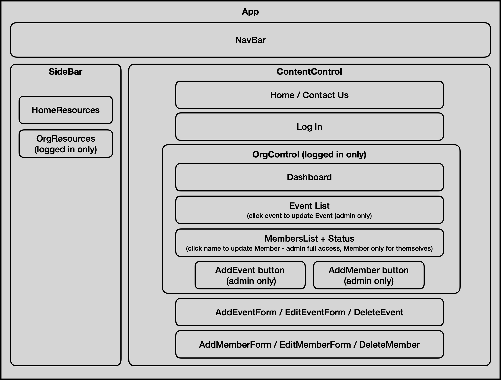

# 
## _Manage Disruption Events and Stay Connected_
### by: Micah L. Olson
### created: 5/7/2021
### updated: 5/26/2021

---

## Description
This is the front-end to *Rally Point*, an application for organizations and their members to manage emergency or similar disruption events by allowing organizers to post event notifications, organize contingency plans, and provide a direct check-in process for members in lieu of the antiquated call-tree process.

---

## Technologies Used
* React
* Axios
* JavaScript
* JSX
* HTML
* CSS
* Node.js
* npm
* Markdown
* git

---

## Component Diagram
  <div>
    
  </div>

---

## Installation and Setup
* You will need to use your system's **`terminal` emulator** to set up and locally use this application.

* First **set up the back-end application** for this project at https://github.com/MicahOlson/rally-point-api.

* Then **clone this repository** to a local directory using the command-line tools `cd` and `git`.  
  <small>
    ([how to install git](https://www.learnhowtoprogram.com/introduction-to-programming/getting-started-with-intro-to-programming/git-and-github))
  </small>
  ```bash
  $ cd ~/<local_directory>/
  $ git clone https://github.com/MicahOlson/rally-point.git
  ```

* **Navigate to the top level directory** of the cloned repository.  
  ```bash
  $ cd rally-point/
  ``` 

* **Install all application dependencies** using the `Node Package Manager` (`npm`).
  ```bash
  $ npm install
  ```

* **Launch a local web server** to interact with the application in a browser.
  ```bash
  $ npm start
  ```

  * IMPORTANT! Be sure to **shut the server down** when you are done using the app.  
    `control-c`

* If it doesn't launch automatically, type **localhost:3001** into your browser's address bar and hit `enter`.

* Properly setting up the **backend application** mentioned above will supply 3 default users for demonstration purposes:
  * Jane Smith, MyCompany
    * Email: jane@mycompany.com
    * Password: jane123
    * Admin for MyCompany with ability to 
      * add, edit, delete event posts
      * add, edit, delete new MyCompany members
  * Bob Philips, MyCompany
    * Email: bob@mycompany.com
    * Password: bob123
    * Standard member of MyCompany with limited rights to
      * view event posts
      * check in for new events
      * edit, delete personal profile
  * Keith Johnson, YourCompany
    * Email: keith@yourcompany.com
    * Password: keith123
    * Admin for YourCompany with ability to 
      * add, edit, delete event posts
      * add, edit, delete new YourCompany members

---

## Code Editors
* **Recommendations** if you would like to utilize a **GUI** for opening or editing this application's files:
  * [Visual Studio Code](https://code.visualstudio.com) - "Code editing. Redefined."
  * [Atom](https://atom.io) - "A hackable text editor for the 21st Century."
  * [SublimeText](https://www.sublimetext.com) - "A sophisticated text editor for code, markup and prose."

---

## Notes, Bugs, and Fixes
* Organization name occasionally disappears from navbar display after visiting the notifications page.
* Check-in button on notifications page should re-mount component and disappear after member has clicked it; currently there is no feedback.
* Notifications page does not display new content until user navigates away and then back.
* App crashes if there is no initial record for event notifications or members.
* Reset Checkins button currently does nothing; this should be removed and intended functionality triggered when new notifications are posted.
* If you find other bugs, please report it at the email address below.

## Future Enhancements
* Functionality to email and text users when a new event notification is posted, and continue to do so periodically until the member checks in.
* Responsive design for mobile use.
* Dynamic maps of organization locations and rally points via Google Map API (and directions from members' geolocation).
* Auto-feed of local disruption event information directly to organization pages from a relevant API.
* Many-to-many relationship from many members to many organizations.
* Support multiple sites/locations option for organizations, and additional authorization limits to members for these locales.

---

## License
[MIT](https://choosealicense.com/licenses/mit/)  
Copyright &copy; 2021 Micah L. Olson

---

## Contact
Micah via [email](mailto:micah.olson@protonmail.com) | [LinkedIn](https://www.linkedin.com/in/micah-lewis-olson/) | [GitHub](https://github.com/MicahOlson)
